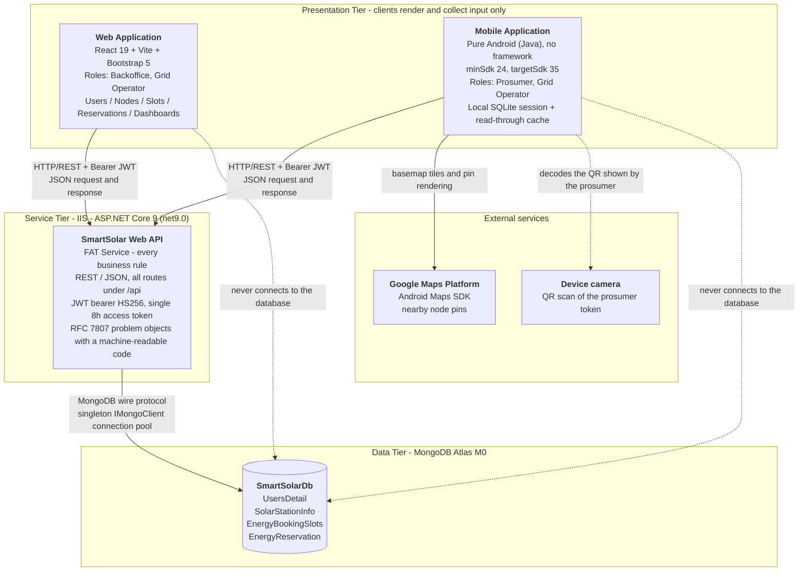
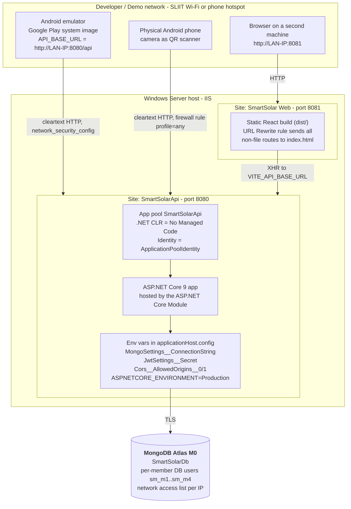
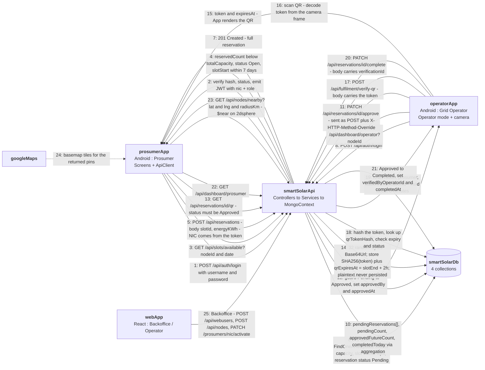
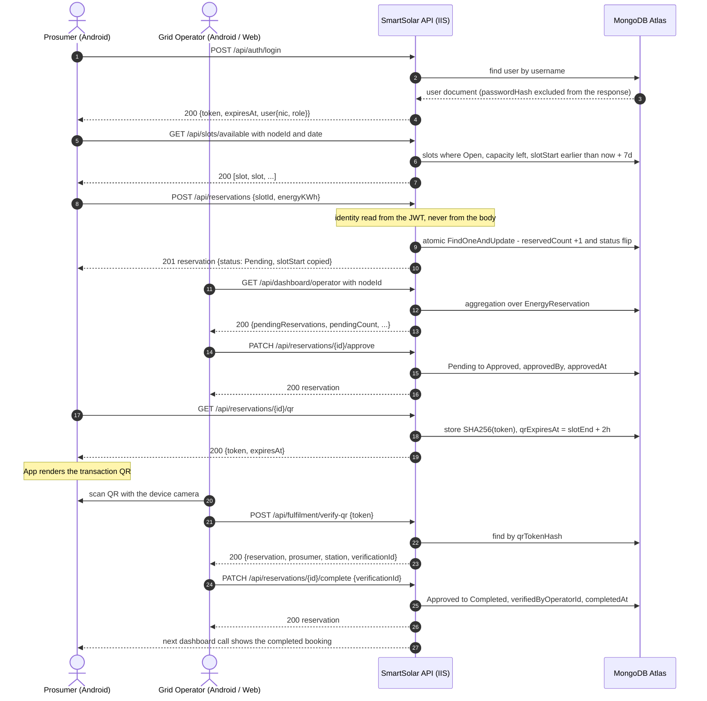
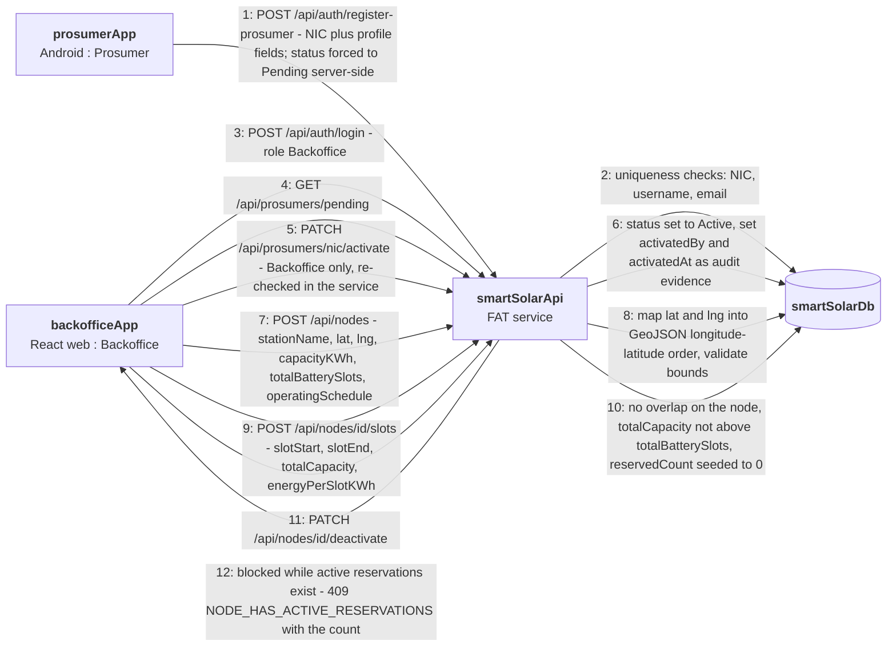
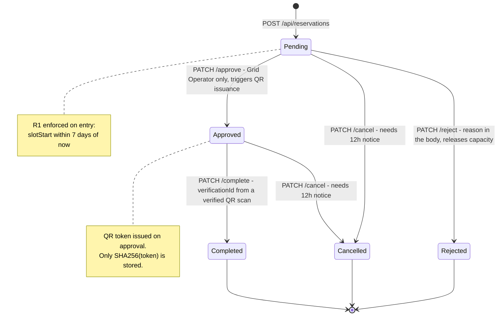

# Architecture — Smart Solar Microgrid Trading System

**Status:** Living document. It describes the system as designed by the group contract
(`api-contract.md`, `db-schema.md`, `auth.md`, `response-format.md`) and records the
components each vertical owns. Diagrams are written in Mermaid so they render in the
VS Code Markdown preview and can be exported for the report.

---

## 1. What this system is about

SolarSync is a **client–server microgrid energy trading platform**. It lets owners of solar
panel arrays (**prosumers**) sell surplus energy into — and draw energy from — a network of
small, geographically distributed solar storage hubs (**microgrid nodes**). A single central
web service owns every rule, every calculation and the only database. The two clients are
pure user interfaces.

### The three actors

| Actor                  | Client                     | What they do                                                                                                                                                                                                                                   |
| ---------------------- | -------------------------- | ---------------------------------------------------------------------------------------------------------------------------------------------------------------------------------------------------------------------------------------------- |
| **Solar Prosumer**     | Mobile app (Android)       | Registers with their NIC, manages their profile, reserves/modifies/cancels energy drop-off or charging slots, receives a transaction QR code once a booking is approved, tracks booking history and sees nearby nodes on a map                 |
| **Grid Operator**      | Web app **and** mobile app | Runs the operational side: monitors the reservation queue, approves or rejects bookings, scans the prosumer's QR code at the node, verifies it against the server and finalises the energy transfer                                            |
| **Backoffice Officer** | Web app                    | Administration: creates and manages web users, activates/deactivates prosumer and node records, defines microgrid nodes with GPS location and capacity, manages schedules. Backoffice-only actions include reactivating a deactivated prosumer |

### The business flow in one paragraph

A prosumer reserves a time slot at a node. The API validates the reservation (identity from
the JWT, slot within the next **7 days**, capacity available, no duplicate active booking) and
atomically claims one of the slot's capacity units. The booking sits as `Pending` until a
**Grid Operator** approves it. Approval triggers issuance of a single-use **QR token** —
only its SHA-256 hash is stored. At the node, the operator scans that QR code; the API
verifies the token against the stored hash, checks it has not expired (`slotEnd + 2h`) and
issues a short-lived `verificationId`. The operator submits that `verificationId` to complete
the reservation, which is what prevents a transfer being finalised without a real scan.
Cancellations and modifications are allowed only with **at least 12 hours' notice**.

### The four core rules the architecture exists to enforce

| Rule                                      | Where it is enforced                                                                                            |
| ----------------------------------------- | --------------------------------------------------------------------------------------------------------------- |
| **R1 — 7-day booking window**             | `ReservationService`, server-side only                                                                          |
| **R2 — 12-hour notice for update/cancel** | `ReservationService`, evaluated against the `slotStart` **copied onto the reservation** at creation             |
| **R6 — atomic capacity claim**            | A single `FindOneAndUpdate` in `ReservationService` that mutates `reservedCount` and the slot `status` together |
| **Backoffice-only reactivation**          | `[Authorize(Roles = "Backoffice")]` **and** a re-check inside `UserService.Activate`                            |

---

## 2. Architectural principles

These are the constraints the grading rubric and the group contract impose on every design
decision in the sections below.

1. **FAT service, thin clients.** All business logic lives in the central API. Both clients are
   UI + presentation only. A rule that a user could bypass by editing a request in a REST
   client is a rule implemented in the wrong place.
2. **No client ever opens a database connection.** The web app has no Mongo dependency and
   the Android app has no Mongo dependency. Only the API talks to Atlas.
3. **Clients never decide whether a rule passes.** They render the API's verdict and display
   the API's `detail` message. Error codes are machine-readable; message text is authored
   server-side.
4. **Identity never travels in the payload.** `nic`, `userId` and `role` are read from the JWT
   claim, never from a request body, for any prosumer-owned action.
5. **Stateless authentication.** One HS256 JWT, 8-hour expiry, no refresh token, no server
   session. Authorisation is enforced by the framework before any service code runs.
6. **Local persistence is a cache, never authoritative.** Android's SQLite holds the session
   row and a read-through cache. There are no offline queued writes.
7. **One writer per invariant.** `reservedCount`, the active-reservation predicate and the
   status-transition guard are written once (by M3) and _called_ by the other verticals.
8. **UTC everywhere.** All rule evaluation uses `DateTime.UtcNow`. Clients convert to local
   time for display only.

---

## 3. High-level architecture

The classic three-tier client–server shape required by the specification: two UI clients,
one fat central service on IIS, one NoSQL database.

**How to read it**

- The **clients are interchangeable consumers of the same contract**. The web app and the
  Android app call the same `/api` routes with the same JSON; only the role claim in the JWT
  changes which routes they are allowed to reach. The spec's "both clients interact with the
  web service to access processed data and business logic" is exactly this: no per-client
  business rules exist.
- The **dotted lines to the database are deliberately marked as forbidden**. They document
  the architectural boundary that the rubric checks (`web/package.json` and
  `mobile/app/build.gradle.kts` must show no database driver).
- **Google Maps is a client-side presentation dependency only.** The _distance_ calculation
  is not done on the device: `/api/nodes/nearby` runs a `$near` query on the 2dsphere index
  and returns a `distanceKm` per node. The map draws what the API returns.

---

## 4. Deployment view

Two IIS sites on the same machine, one shared Atlas cluster, and clients reaching the API
over the LAN IP.

**Key deployment facts**

| Item              | Value                                                                                                        |
| ----------------- | ------------------------------------------------------------------------------------------------------------ |
| API site          | IIS, port **8080**, folder `C:\inetpub\smartsolar-api` (outside the repo)                                    |
| Web site          | IIS, port **8081**, folder `C:\inetpub\smartsolar-web`, URL Rewrite for SPA routes                           |
| App pool CLR      | **No Managed Code** — ASP.NET Core runs out of process                                                       |
| Publish command   | `dotnet publish -c Release -o <folder>`                                                                      |
| Configuration     | Environment variables, set in `applicationHost.config` (not `web.config`, which `dotnet publish` overwrites) |
| Database          | One shared Atlas M0 cluster, database `SmartSolarDb`, four collections, indexes created by M2                |
| Dev URLs          | API `http://localhost:5199/api`, web `http://localhost:5173`                                                 |
| Emulator URL      | `http://10.0.2.2:5199/api` locally, or the host LAN IP for a device                                          |
| CORS              | Named policy reading `Cors:AllowedOrigins`; never `AllowAnyOrigin` with credentials                          |
| Android cleartext | `res/xml/network_security_config.xml` permits cleartext for the LAN IP only                                  |

---

## 5. Component diagram

The same three tiers, opened up. Each box is a component the group actually builds; each is
owned by one member (M1–M4) so that no two people edit the same file.

```mermaid
flowchart TB
    %% ---------------- WEB CLIENT ----------------
    subgraph WEBAPP["Web Application - React 19 + Vite (M1 owns the shell)"]
        direction TB
        APICLIENT["services/apiClient.js<br/>single axios instance<br/>request interceptor adds Bearer token<br/>response interceptor normalises problem object, 401 clears session"]
        AUTHCTX["context/AuthContext.jsx<br/>user + role state, login/logout<br/>restores session via GET /auth/me"]
        PROTECT["ProtectedRoute<br/>allowed-roles list per route"]
        LAYOUT["layouts/AppLayout.jsx<br/>navbar + sidebar, nav filtered by role"]
        ERRMAP["utils/errorMessages.js<br/>maps server code to friendlier text"]
        subgraph WEBPAGES["pages/"]
            W_AUTH["auth/ - Login"]
            W_USERS["users/ - Prosumer and web user management"]
            W_NODES["nodes/ - Node and slot management"]
            W_RES["reservations/ - Booking queue, approve and reject"]
            W_DASH["dashboard/ - Operator and admin dashboards"]
        end
    end

    %% ---------------- MOBILE CLIENT ----------------
    subgraph MOBILEAPP["Mobile Application - pure Android Java (M4 owns the plumbing)"]
        direction TB
        NET["network/<br/>ApiClient - HttpURLConnection get/post/put/delete<br/>patch via POST + X-HTTP-Method-Override<br/>ApiResult, ApiCallback, ErrorParser, DateUtils"]
        DBH["database/<br/>DatabaseHelper (SQLiteOpenHelper)<br/>DAOs: session, cached_nodes, cached_bookings, sync_meta"]
        PARSE["parsers/<br/>UserParser, NodeParser, ReservationParser, FulfilmentParser"]
        QRCOMP["QR component<br/>generates the transaction QR<br/>scans the operator-side camera"]
        subgraph SCR["Screens and Activities"]
            M_AUTH2["Login and registration (NIC)"]
            M_DASH["Dashboard: active/pending counts, next booking"]
            M_MAP["Nearby nodes on Google Maps"]
            M_BOOK["Reserve / modify / cancel a slot"]
            M_HIST["Booking history, pending bookings, search"]
            M_OP["Operator mode: scan, verify, finalise"]
        end
    end

    %% ---------------- API ----------------
    subgraph APIAPP["SmartSolar Web API - ASP.NET Core 9 (FAT service)"]
        direction TB
        subgraph PIPE["Middleware pipeline - order is contractual"]
            MW1["1. ExceptionHandlingMiddleware<br/>BusinessRuleException to problem object<br/>everything else to generic 500"]
            MW2["2. UseCors - named policy from configuration"]
            MW3["3. UseAuthentication - JWT bearer validation"]
            MW4["4. MethodOverrideMiddleware<br/>POST + X-HTTP-Method-Override: PATCH<br/>authenticated requests only, before routing"]
            MW5["5. UseAuthorization + MapControllers"]
        end

        subgraph HELPERS["Cross-cutting helpers"]
            BRE["BusinessRuleException(code, title, detail, status)"]
            JWTG["JwtTokenGenerator<br/>emits sub, nic, role, name"]
            PASS["PasswordHasher - PBKDF2"]
            DTO["DTOs - passwordHash excluded at this layer"]
        end

        subgraph CTRL["Controllers - thin, no business rules"]
            C1["AuthController / UsersController / ProsumersController"]
            C2["NodesController / SlotsController"]
            C3["ReservationsController"]
            C4["FulfilmentController / DashboardController"]
        end

        subgraph SVC["Services - all business logic lives here"]
            S1["UserService<br/>NIC uniqueness, Pending on register,<br/>last-Backoffice guard, activate and deactivate"]
            S2["NodeService / SlotService<br/>GeoJSON lng,lat, capacity bounds,<br/>overlap, status and reservedCount invariants"]
            S3["<b>ReservationService</b><br/>R1 7-day window, R2 12h notice,<br/>R6 atomic capacity claim,<br/>duplicate check, transition guard"]
            S4["FulfilmentService / DashboardService<br/>QR issuance and hash verification,<br/>aggregation-based counts"]
            SHARED["<b>Shared rule surface - written once by M3</b><br/>CountActiveForStation / CountActiveForSlot / CountActiveForProsumer<br/>active predicate: status in Pending or Approved AND slotStart later than utcNow<br/>reservedCount mutation plus slot status flip, single atomic write"]
        end

        subgraph REPO["Persistence"]
            MONGOC["MongoContext<br/>singleton, one IMongoCollection per collection"]
            MODELS["Models: User, SolarStation, BookingSlot, Reservation<br/>camelCase conventions, _id serialised as a string"]
        end
    end

    %% ---------------- DATABASE ----------------
    subgraph DBLAYER["MongoDB Atlas"]
        COLL[("<b>SmartSolarDb</b><br/>UsersDetail / SolarStationInfo<br/>EnergyBookingSlots / EnergyReservation")]
    end

    %% ---------------- WIRING ----------------
    AUTHCTX --> PROTECT --> LAYOUT
    W_AUTH --> AUTHCTX
    W_USERS --> APICLIENT
    W_NODES --> APICLIENT
    W_RES --> APICLIENT
    W_DASH --> APICLIENT
    W_USERS --> ERRMAP
    APICLIENT -->|"REST /api - one axios instance"| MW1

    M_AUTH2 --> NET
    M_DASH --> NET
    M_MAP --> NET
    M_BOOK --> NET
    M_HIST --> NET
    M_OP --> NET
    NET --> QRCOMP
    NET --> DBH
    NET --> PARSE
    NET -->|"REST /api - HttpURLConnection"| MW1

    MW1 --> MW2
    MW2 --> MW3
    MW3 --> MW4
    MW4 --> MW5
    MW5 --> C1
    MW5 --> C2
    MW5 --> C3
    MW5 --> C4

    C1 --> S1
    C2 --> S2
    C3 --> S3
    C4 --> S4

    S3 --> SHARED
    S1 --> SHARED
    S1 --> BRE
    S3 --> BRE
    S4 --> BRE
    S1 --> DTO
    S3 --> DTO
    S1 --> MONGOC
    S2 --> MONGOC
    S3 --> MONGOC
    S4 --> MONGOC
    MONGOC --> MODELS --> COLL
    MW3 --> JWTG
    S1 --> PASS
```

### 5.1 Component responsibilities

| Tier   | Component                                            | Responsibility                                                                                                                                   | Owner        |
| ------ | ---------------------------------------------------- | ------------------------------------------------------------------------------------------------------------------------------------------------ | ------------ |
| API    | `Program.cs`                                         | Composition root: binds settings, registers the singleton Mongo client and `MongoContext`, configures JWT + CORS, fixes middleware order         | M2 / M1 / M4 |
| API    | `ExceptionHandlingMiddleware`                        | The **only** place a problem object is written. Services throw; this formats                                                                     | M4           |
| API    | `MethodOverrideMiddleware`                           | Rewrites authenticated `POST` + `X-HTTP-Method-Override: PATCH` into `PATCH` so Android can reach the nine PATCH routes                          | M4           |
| API    | `JwtTokenGenerator`                                  | Issues the single 8-hour HS256 token carrying `sub`, `nic`, `role`, `name`                                                                       | M1           |
| API    | `MongoContext`                                       | One `IMongoCollection<T>` property per collection; resolves the database once                                                                    | M2           |
| API    | `UserService`                                        | Registration with `Pending` forced server-side, NIC uniqueness, last-Backoffice guard, activation/deactivation with the active-reservation check | M1           |
| API    | `NodeService` / `SlotService`                        | GeoJSON `[lng, lat]` mapping, capacity bounds, slot overlap, node deactivation block, slot `status` ↔ `reservedCount` consistency                | M2           |
| API    | `ReservationService`                                 | R1, R2, R6, duplicate detection, the single status-transition guard, and the shared `CountActiveFor*` surface                                    | M3           |
| API    | `FulfilmentService` / `DashboardService`             | QR issuance (plaintext never stored, only `SHA256(token)`), verification and `verificationId`, Mongo-aggregation dashboard counts                | M4           |
| Web    | `apiClient.js`                                       | One axios instance; attaches the token in one place, normalises errors in one place                                                              | M1           |
| Web    | `AuthContext` + `ProtectedRoute` + role-filtered nav | Session lifecycle and route guarding — convenience only, **not** a security boundary                                                             | M1           |
| Mobile | `network/ApiClient`                                  | All HTTP; the `getErrorStream()` branch is what surfaces server business messages                                                                | M4           |
| Mobile | `database/DatabaseHelper` + DAOs                     | SQLite: session row + read-through caches, cleared on logout                                                                                     | M4           |
| Mobile | `parsers/*`                                          | One parser file per member so no two people edit the same file                                                                                   | All          |
| Mobile | QR component                                         | Generates the transaction QR after approval; scans it in operator mode                                                                           | M4           |
| DB     | Four collections                                     | The only persistence. Reference held by the child document                                                                                       | M2           |

---

## 6. Communication diagram

A UML-style communication diagram: the **objects** that take part, the **links** between them,
and the **numbered, ordered messages** that travel along those links. The scenario below is
the complete lifecycle of one energy transfer — the flow the assignment calls
"reserve → approve → QR dispatch → verify → finalise".

### 6.1 Message-to-rule trace

| Message | Route                               | Rule enforced server-side                                                                      | Failure code                                                                         |
| ------- | ----------------------------------- | ---------------------------------------------------------------------------------------------- | ------------------------------------------------------------------------------------ |
| 2       | `POST /auth/login`                  | Password hash, account status                                                                  | `AUTH_INVALID_CREDENTIALS`, `AUTH_ACCOUNT_PENDING`, `AUTH_ACCOUNT_DEACTIVATED`       |
| 4       | `GET /slots/available`              | `reservedCount < totalCapacity`, `Open`, `slotStart ≤ now + 7d`                                | — (filter)                                                                           |
| 5–6     | `POST /reservations`                | **R1** 7-day window, node `Active`, capacity, no duplicate active booking, **R6** atomic claim | `RESERVATION_OUTSIDE_WINDOW` (422), `RESERVATION_SLOT_FULL`, `RESERVATION_DUPLICATE` |
| 11–12   | `PATCH /reservations/{id}/approve`  | `GridOperator` only, from `Pending` only                                                       | `AUTH_FORBIDDEN_ROLE`, `RESERVATION_INVALID_STATE`                                   |
| 13–15   | `GET /reservations/{id}/qr`         | Own reservation, status `Approved`; token hashed before storage                                | —                                                                                    |
| 17–19   | `POST /fulfilment/verify-qr`        | Hash match, not expired, still `Approved`                                                      | `QR_INVALID` (400), `QR_EXPIRED` (410), `QR_ALREADY_USED` (409)                      |
| 20–21   | `PATCH /reservations/{id}/complete` | Valid unexpired `verificationId`, from `Approved`                                              | `RESERVATION_INVALID_STATE`                                                          |

### 6.2 The same flow as a sequence diagram

The communication diagram shows _which objects are linked_; this one shows _time_.

### 6.3 Backoffice management flow (second communication diagram)

A shorter one, covering the scenario the spec calls "the Backoffice team is responsible for
managing the registration of solar microgrid nodes and maintaining their operational
schedules".

---

## 7. Reservation lifecycle

The state machine that `ReservationService`'s single guard method enforces. Every illegal
transition returns `409 RESERVATION_INVALID_STATE`.

---

## 8. Cross-cutting concerns

| Concern                   | Design                                                                                                                                                           | Where                                          |
| ------------------------- | ---------------------------------------------------------------------------------------------------------------------------------------------------------------- | ---------------------------------------------- |
| **Authentication**        | JWT bearer, HS256, 8h, `ClockSkew = TimeSpan.Zero`, `MapInboundClaims = false` with `RoleClaimType = "role"`                                                     | `Program.cs`, `JwtTokenGenerator`              |
| **Authorisation**         | `[Authorize(Roles = "...")]` at the controller, plus a service-layer re-check for the Backoffice-only and own-data-only rules                                    | Controllers + `UserService`                    |
| **Error contract**        | One global middleware turns a thrown `BusinessRuleException` into the RFC 7807 problem object with a machine-readable `code`. Service throws; middleware formats | `ExceptionHandlingMiddleware`                  |
| **Android PATCH**         | `POST` + `X-HTTP-Method-Override: PATCH`, honoured only for authenticated requests, rewritten before routing                                                     | `MethodOverrideMiddleware`                     |
| **CORS**                  | Named policy with origins from `Cors:AllowedOrigins`; never `AllowAnyOrigin` with credentials                                                                    | `Program.cs`                                   |
| **Time**                  | Everything UTC; `slotStart` is **copied onto the reservation** at creation so a later slot edit cannot move someone's cancellation deadline                      | All services                                   |
| **Secret handling**       | User secrets in development, environment variables on IIS, templates only in the repo                                                                            | `appsettings.Example.json`, `web/.env.example` |
| **Referential integrity** | The reservation carries `prosumerNIC` (business key) and denormalised `stationId`, so history filters without a join                                             | `db-schema.md` §4                              |
| **Geospatial**            | `location` stored as GeoJSON `[lng, lat]` with a `2dsphere` index; `/nodes/nearby` uses `$near` so distance is computed server-side                              | `NodeService`                                  |

---

## 9. Data ownership map

| Collection           | Holds                                                                                             | Written by                                                         | Read by                                                          |
| -------------------- | ------------------------------------------------------------------------------------------------- | ------------------------------------------------------------------ | ---------------------------------------------------------------- |
| `UsersDetail`        | All three roles, discriminated by `role`; NIC unique-sparse and immutable                         | M1                                                                 | M1, M3 (identity checks), M4 (dashboards)                        |
| `SolarStationInfo`   | Nodes with GeoJSON `location`, `capacityKWh`, `totalBatterySlots`, embedded `operatingSchedule[]` | M2                                                                 | M2, M3 (node must be `Active`), M4 (nearest-node and dashboards) |
| `EnergyBookingSlots` | Bookable windows per node; `totalCapacity`, `reservedCount`, stored `status`                      | M2 creates, **M3 alone mutates `reservedCount`**                   | M2, M3, M4                                                       |
| `EnergyReservation`  | The booking lifecycle, notice-period deadline (`slotStart`), audit fields and the QR hash         | M3 creates and transitions; M4 writes the QR fields and completion | All four verticals                                               |

**Three denormalisation decisions worth defending at viva**

1. `slotStart` is copied onto the reservation so R2 is evaluated against a frozen deadline.
2. `stationId` is denormalised onto the reservation so node-scoped history needs no join.
3. Slot `status` is **stored, not computed**, so the mobile slot list filters server-side.

---

## 10. Vertical ownership map

The architecture is deliberately partitioned so that no two members edit the same file, and
so that shared logic has exactly one author.

| Member | Vertical                         | Controllers                                                     | Service                                                     | Client surfaces                                                                     |
| ------ | -------------------------------- | --------------------------------------------------------------- | ----------------------------------------------------------- | ----------------------------------------------------------------------------------- |
| **M1** | Identity and access              | `AuthController`, `UsersController`, `ProsumersController`      | `UserService`                                               | Web shell, auth, user management pages; Android `session` DAO                       |
| **M2** | Nodes, slots, sample data        | `NodesController`, `SlotsController`                            | `NodeService`, `SlotService`                                | Web node/slot management; Android `cached_nodes` DAO and node parser                |
| **M3** | Reservations                     | `ReservationsController`                                        | `ReservationService` + the shared `CountActiveFor*` surface | Web reservation queue; Android reservation parser                                   |
| **M4** | Fulfilment, dashboards, platform | `FulfilmentController`, `DashboardController`, `PingController` | `FulfilmentService`, `DashboardService`                     | Android networking, SQLite, QR, operator mode; IIS deployment; exception middleware |

**Shared code, single writer:** the active-reservation predicate, the `reservedCount`
mutation and the status-transition guard are written once by **M3** and _called_ by M1, M2 and
M4. A second copy produces drift that only shows up after a dozen operations — which means
during the demo.

---

## 11. Implementation status

As at 2026-09-24:

| Area                                                                                                                     | State                                                                                                                  |
| ------------------------------------------------------------------------------------------------------------------------ | ---------------------------------------------------------------------------------------------------------------------- |
| Shared plumbing §1–5 (config binding, Mongo context and models, exception middleware, method override, JWT + CORS, ping) | **Done**                                                                                                               |
| Seed data in Atlas with verified references                                                                              | **Done**                                                                                                               |
| First IIS publish of the API on port 8080, env vars, firewall, phone + emulator ping                                     | **Done**                                                                                                               |
| Web client                                                                                                               | Scaffolding only — Vite/React shell; `apiClient`, `AuthContext`, routes and pages still to build                       |
| Android client                                                                                                           | Scaffolding only — `MainActivity` logs `BuildConfig.API_BASE_URL`; networking, SQLite, parsers, screens still to build |
| Feature verticals (M1–M4 endpoints and screens)                                                                          | Not started                                                                                                            |

---

## 12. Diagram index for the report

| Report figure                  | Diagram in this document                                    |
| ------------------------------ | ----------------------------------------------------------- |
| Overall system architecture    | §3 High-level architecture                                  |
| Deployment architecture        | §4 Deployment view                                          |
| Component architecture         | §5 Component diagram                                        |
| Communication diagram          | §6 Communication diagram (and §6.3 for the backoffice flow) |
| Interaction / sequence diagram | §6.2 Sequence diagram                                       |
| State chart                    | §7 Reservation lifecycle                                    |

> All diagrams are Mermaid source. In VS Code, open the Markdown preview to render them, or
> paste a block into <https://mermaid.live> and export PNG/SVG for the report.
