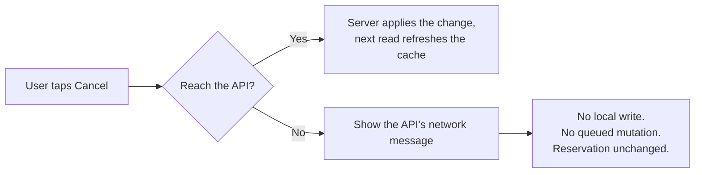

# SQLite on Android — Cache Strategy and Test Results

## Why this document exists

The brief awards marks for local persistence on Android, and the rubric warns
against the opposite failure: _"Clients rarely reach the API, or hold business
logic and data locally."_ Those two pull against each other, so this note states
the position plainly and records the tests that back it up.

**SQLite on Android is a cache and a session store. It is never authoritative.**
The API decides everything. The cache holds only what the API already told us,
and it is labelled whenever it is used as a substitute for asking again.

---

## 1. Schema

Four tables, created by `database/DatabaseHelper.java`, named by
`database/DbContract.java`. The database is `smartsolar.db`, version 1.

| Table             | Holds                                                                      | Written by                                  |
| ----------------- | -------------------------------------------------------------------------- | ------------------------------------------- |
| `session`         | One row: token, userId, username, nic, fullName, role, issuedAt, expiresAt | `SessionManager.save()` on login            |
| `cached_nodes`    | The node list                                                              | `NodeCache.save()`                          |
| `cached_bookings` | The caller's own bookings                                                  | `BookingCache.save()`                       |
| `sync_meta`       | One row per cache entity: when it was last refreshed                       | Both caches, via `SyncMetaDao.markSynced()` |

**The password is never stored**, in any form. The session row holds a token and
who signed in, and nothing else. There is also no `password` column to store it
in, so this is a property of the schema rather than a convention someone has to
remember.

### Overwrite, not append

`NodeDao.replaceAll()` and `BookingDao.replaceAll()` delete every row and insert
the fresh set inside one transaction. So each cache is a **snapshot of what the
server last said**, not a log of everything ever seen. A booking cancelled
somewhere else disappears from the cache on the next successful read instead of
lingering beside live data.

---

## 2. The four rules, and where each is enforced

### Rule 1 — the session survives an app restart

`LoginActivity` is the launcher. In `onCreate` it calls
`SessionManager.isLoggedIn(this)`; when that is true it goes straight to
`restoreSession()`, which sends the stored token to `GET /auth/me` and then
routes to the role's home screen via `SessionManager.openHome()`.

If the device is offline (`NO_RESPONSE`), the screen still routes on the role
stored in the session row — but every request made afterwards is still judged by
the API, so an offline route grants nothing.

`isLoggedIn()` checks the token **and** the `expiresAt` the API issued. An
expired session never reaches the network. This is not the client deciding a
rule: the expiry is a property of the token the server minted, and the API still
returns `401` and clears the session if it disagrees.

### Rule 2 — read-through only

Every cached screen asks the API **first** and follows the same three steps:

1. Call the API.
2. On success, render the response, then overwrite the cache.
3. On failure, read the cache and label it with the time it was taken.

| Screen               | Cached?                | Behaviour when the API fails                                       |
| -------------------- | ---------------------- | ------------------------------------------------------------------ |
| `MyBookingsActivity` | Yes, `cached_bookings` | Last known bookings plus "Showing saved data from HH:mm"           |
| `NodeListActivity`   | Yes, `cached_nodes`    | Last known nodes plus the same label                               |
| `QrDisplayActivity`  | Reads only             | Last known approved bookings, with the API's message and the label |

The cache is written **after** the response is rendered, never before, and never
while a call is still in flight. A screen showing cached data always says so —
the live and cached paths cannot look the same on screen, because the label is a
separate view that is hidden on the live path.

Note that `SessionManager` and `BookingCache.lastRefreshedDisplay()` share one
formatter (`utils/StaleLabel.java`), so there is one definition of what a stale
label says.

### Rule 3 — no offline writes, no queued mutations

There is no queue of pending actions anywhere in the app, and no table that
could hold one. Every write — create, edit, cancel, scan, complete — goes
straight to the API. If it fails, the screen shows the API's own message
and **nothing is written locally**:



The API client reads the token from the session row for every request, but the
cache is never consulted to decide whether a write should happen.

### Rule 4 — cleared on logout

`DatabaseHelper.clearAll()` deletes the contents of all four tables in one call.
It is invoked on every path that ends a session:

- `SessionManager.logout()` — the Log out button on both home screens
- `SessionManager.handleAuthError()` — any `401 AUTH_INVALID_TOKEN`, called from every screen
- `SessionManager.clear()` — a prosumer who deactivates their own account
- `LoginActivity` — a session the API rejected during restore

So a second user on the same device finds no trace of the first user's bookings,
nodes, or session.

---

## 3. What is deliberately _not_ cached

An omission and a decision look the same in code, so they are listed here.

| Screen                                                                             | Why not                                                                                                                                                                                                                                       |
| ---------------------------------------------------------------------------------- | --------------------------------------------------------------------------------------------------------------------------------------------------------------------------------------------------------------------------------------------- |
| `QrDisplayActivity` (the token), `QrScannerActivity`, `VerificationResultActivity` | Security-sensitive. The QR token expires and is single-use, and the verification verdict decides whether energy changed hands. A cached one would be shown after the server had already invalidated it. The token is fetched live every time. |
| `SlotSearchActivity`                                                               | Availability must be live. A cached slot may already be taken; showing it would invite a booking that cannot succeed.                                                                                                                         |
| `NearbyNodesMapActivity`                                                           | Distance is measured from where the phone is standing. A stored distance would be wrong the moment the user moved, and wrong silently.                                                                                                        |
| `MyProfileActivity`, `NodeDetailActivity`                                          | Single-record reads with little offline value, and the profile is editable — a cached copy would sit next to an API that had just rejected a change.                                                                                          |
| All create / edit / cancel screens                                                 | Writes. Rule 3.                                                                                                                                                                                                                               |

**One writer per cache.** `cached_bookings` is written only by the screen that
reads the _unfiltered_ `/reservations/mine`, because that is the only read that
returns the complete set. `QrDisplayActivity` reads the _filtered_ route
(`?status=Approved`) and so reads the cache but never writes it — otherwise the
snapshot would be silently reduced to the approved subset and the My bookings
screen would show an incomplete list with no way to tell.

---

## 4. Manual tests

These are the checks the brief names. **They are procedures, not results — the
outcome column is filled in by whoever runs them on a device.** A green build
proves the code compiles and says nothing about runtime behaviour, so these are
the only way to demonstrate the four rules. None have been run yet.

Run on the emulator against the hosted API, with the device clock and the API
both in UTC.

Run by: ********\_\_******** Date: ****\_\_****

| #   | Rule | Steps                                                               | Expected                                                                         | Result |
| --- | ---- | ------------------------------------------------------------------- | -------------------------------------------------------------------------------- | ------ |
| T1  | 1    | Log in · kill the app from the recents tray · relaunch              | Role's home screen, no login form                                                | ☐      |
| T1b | 1    | Set an expired `expires_at` while the app is closed · relaunch      | Login form, and no request is sent                                               | ☐      |
| T2  | 2    | Open My bookings with Wi-Fi on · then Wi-Fi off · leave and re-open | Live: no stale line. Offline: same bookings plus "Showing saved data from HH:mm" | ☐      |
| T2b | 2    | Open the node list offline                                          | Same, with the label, for nodes                                                  | ☐      |
| T3  | 3    | Open a booking with Wi-Fi off · tap Cancel                          | The API's network message, nothing else                                          | ☐      |
| T3b | 3    | After T3, read the reservation through the API                      | Status unchanged — no local write reached the server                             | ☐      |
| T4  | 4    | Log in as prosumer A · open My bookings · log out · log in as B     | B's bookings only                                                                | ☐      |
| T4b | 4    | After logout, dump all four tables                                  | All empty, including `cached_bookings`                                           | ☐      |
| T5  | 2    | Open My bookings twice · count cached rows                          | Equals the API's row count, not double                                           | ☐      |

### Commands for the steps that need one

T1b — back-date the stored expiry:

```
adb shell run-as com.sliit.smartsolar sqlite3 databases/smartsolar.db \
  "update session set expires_at = '2020-01-01T00:00:00Z'"
```

T4b and T5 — inspect the cache directly:

```
adb shell run-as com.sliit.smartsolar sqlite3 databases/smartsolar.db \
  "select count(*) from cached_bookings;"
adb shell run-as com.sliit.smartsolar sqlite3 databases/smartsolar.db \
  "select (select count(*) from session) as s, (select count(*) from cached_nodes) as n, \
          (select count(*) from cached_bookings) as b, (select count(*) from sync_meta) as m;"
```

T3b — read the reservation back with the prosumer's token and compare the status
with what it was before the attempt.

---

## 5. The viva question

> _"Show me your SQLite schema. What happens if local data disagrees with the server?"_

The session table holds the token and who signed in — never the password. The
cache tables are read-through only: the API is always called first, and the cache
is overwritten only after a successful response. If the call fails, the cache is
rendered **with a "Showing saved data from HH:mm" label**, so the user can see it
is not current. The cache can never silently disagree with the server, because it
is only ever written from a server response, and it is cleared on logout. No
writes are queued locally — if the API is unreachable, a write fails visibly and
changes nothing.
